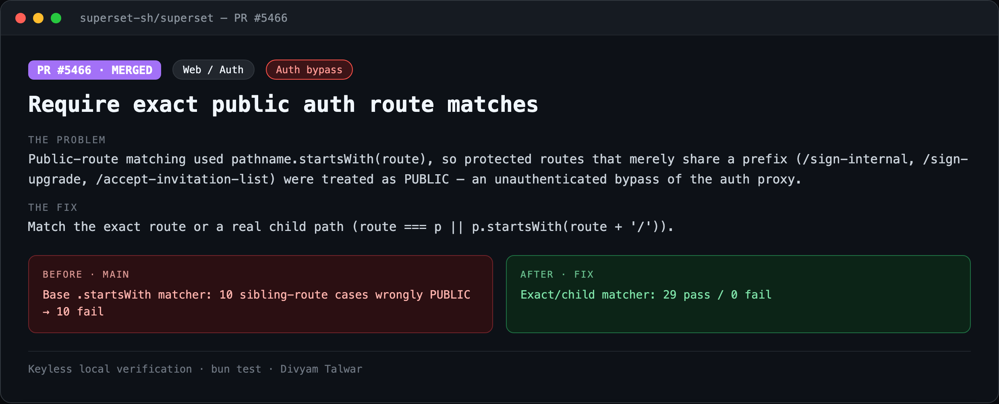
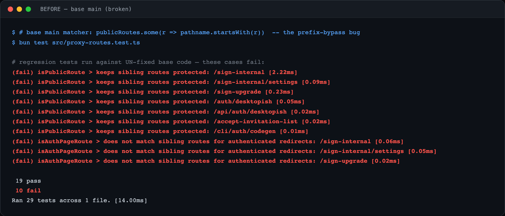
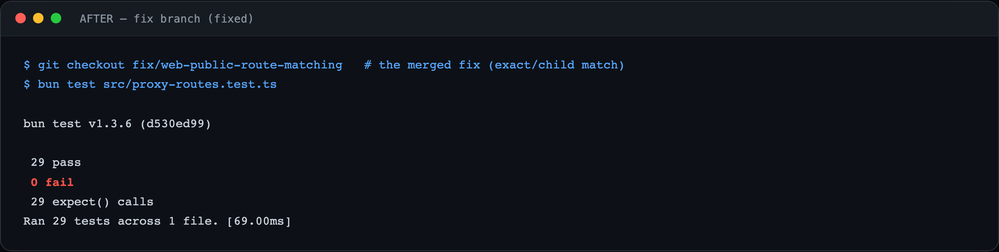

# PR1 — Require exact public auth route matches

| Field | Value |
|---|---|
| PR | [#5466](https://github.com/superset-sh/superset/pull/5466) |
| Status | MERGED |
| Branch | `fix/web-public-route-matching` |
| Head | `832e1846e` |
| Base | `superset-sh/superset:main` |
| Area | Web / Auth |
| Scope | apps/web · 3 files, +78 |
| Risk | low |

## 1. TL;DR
The auth proxy treated any path that *starts with* a public route prefix as public. `/sign-internal`, `/sign-upgrade`, `/accept-invitation-list` were therefore reachable without a session — an authentication bypass. The fix requires an exact route or a real child path.

## 2. The problem
`proxy.ts` decided public access with `publicRoutes.some(r => pathname.startsWith(r))`. Because `/sign-internal`.startsWith(`/sign-in`) is `true`, a protected route that merely shares a prefix with a public one was served to unauthenticated users. Every user of app.superset.sh is on the far side of this proxy, so any such sibling route was an open door.

## 3. How it was identified
Read the Next.js request proxy (`apps/web/src/proxy.ts`) and enumerated the public-route list. Prefix matching immediately looked wrong for `/sign-in` vs `/sign-internal`. Confirmed by running the committed regression test against a faithful reconstruction of the base matcher.

## 4. Root cause
`String.prototype.startsWith` is a prefix test, not a boundary-aware match. `/sign-in` is a prefix of `/sign-internal`, `/sign-up` of `/sign-upgrade`, `/accept-invitation` of `/accept-invitation-list`, `/cli/auth/code` of `/cli/auth/codegen`. All of these resolved to *public*.

## 5. The fix
Extract matching into `proxy-routes.ts` with `matchesRouteOrChild(p, route) = p === route || p.startsWith(route + '/')`. A path is public only if it equals a public route or is a nested child of one. Add `proxy-routes.test.ts` pinning both the allowed exact/child paths and the previously-bypassed siblings.

## 6. Live verification (before / after) — keyless
Real `bun test` output, captured locally with no API key or cloud login. Raw transcripts in [`transcripts/`](./transcripts).

**Summary**

**BEFORE — base `main` (broken)**

Base `.startsWith` matcher, run under the PR's regression suite: **10 sibling-route cases wrongly PUBLIC → 10 fail**.

**AFTER — fix branch**

Exact/child matcher: **29 pass / 0 fail**.

## 7. Risk, compatibility, non-goals
Risk: **low**. This PR is already MERGED into `main` (merged by @Kitenite). The before/after here runs the merged regression test against a verbatim reconstruction of the pre-merge `startsWith` logic (`832e1846e^`), so the 10 failures reproduce the exact bug the merge fixed.

## 8. CI status (honest)
Merged. No outstanding checks.
