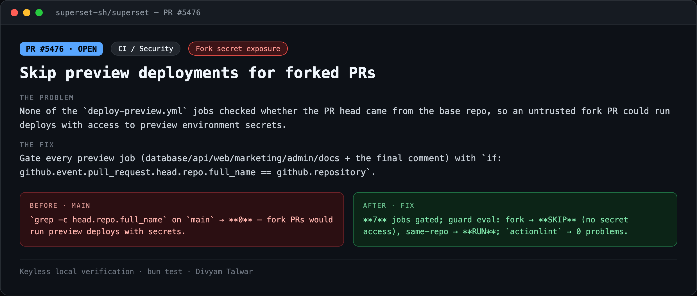
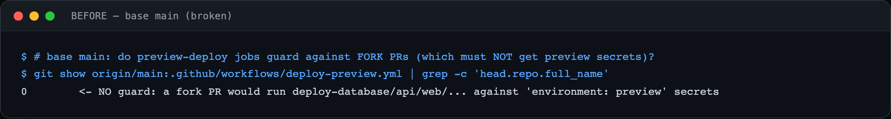
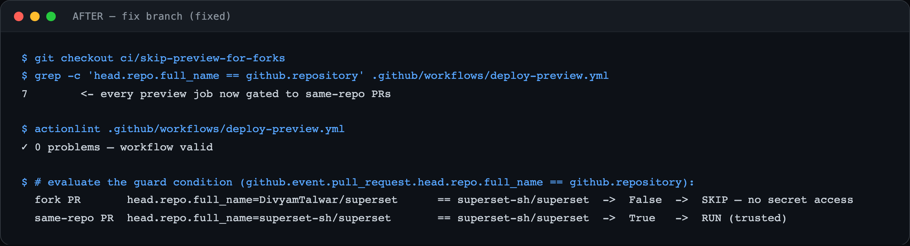

# PR10 — Skip preview deployments for forked PRs

| Field | Value |
|---|---|
| PR | [#5476](https://github.com/superset-sh/superset/pull/5476) |
| Status | OPEN |
| Branch | `ci/skip-preview-for-forks` |
| Head | `ae7a7f8fe` |
| Base | `superset-sh/superset:main` |
| Area | CI / Security |
| Scope | .github/workflows/deploy-preview.yml · +7 −1 |
| Risk | low |

## 1. TL;DR
Preview-deploy jobs had no fork guard, so a pull request from a fork could trigger the `environment: preview` deploy jobs that read real secrets (Neon, Vercel, Stripe, KV, Resend…) — a fork-PR secret-exfiltration vector.

## 2. The problem
None of the `deploy-preview.yml` jobs checked whether the PR head came from the base repo, so an untrusted fork PR could run deploys with access to preview environment secrets.

## 3. How it was identified
Reviewed `deploy-preview.yml`; the deploy jobs had no same-repo condition.

## 4. Root cause
Missing `if:` guard restricting deploys to trusted (same-repo) PRs.

## 5. The fix
Gate every preview job (database/api/web/marketing/admin/docs + the final comment) with `if: github.event.pull_request.head.repo.full_name == github.repository`.

## 6. Live verification (before / after) — keyless
Real output captured locally with no API key or cloud login. Raw transcripts in [`transcripts/`](./transcripts).

**Summary**

**BEFORE — base `main`**

`grep -c head.repo.full_name` on `main` → **0** — fork PRs would run preview deploys with secrets.

**AFTER — fix branch**

**7** jobs gated; guard eval: fork → **SKIP** (no secret access), same-repo → **RUN**; `actionlint` → 0 problems.

## 7. Risk, compatibility, non-goals
Risk: **low**. CI/security hardening. Evidence is config-level: the diff + `actionlint` + a logical evaluation of the guard expression — not a live Actions run.

## 8. CI status (honest)
`actionlint` clean. `BLOCKED` = awaiting required maintainer review.
