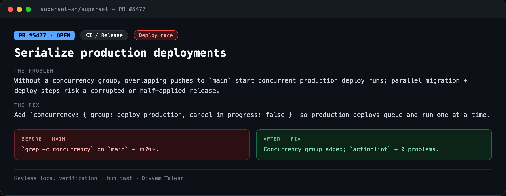
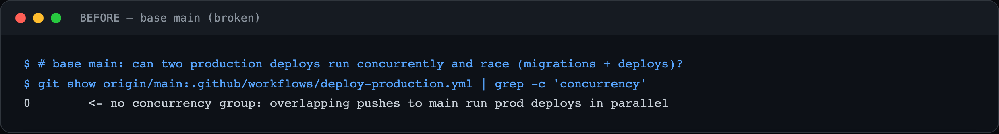
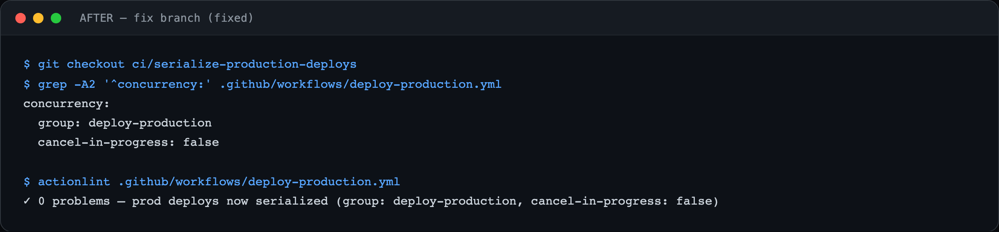

# PR11 — Serialize production deployments

| Field | Value |
|---|---|
| PR | [#5477](https://github.com/superset-sh/superset/pull/5477) |
| Status | OPEN |
| Branch | `ci/serialize-production-deploys` |
| Head | `ef3a91441` |
| Base | `superset-sh/superset:main` |
| Area | CI / Release |
| Scope | .github/workflows/deploy-production.yml · +4 |
| Risk | low |

## 1. TL;DR
`deploy-production.yml` had no concurrency control, so two merges to `main` in quick succession could run production deploys — including DB migrations — in parallel and race.

## 2. The problem
Without a concurrency group, overlapping pushes to `main` start concurrent production deploy runs; parallel migration + deploy steps risk a corrupted or half-applied release.

## 3. How it was identified
Reviewed `deploy-production.yml`; no `concurrency:` block.

## 4. Root cause
Missing concurrency group.

## 5. The fix
Add `concurrency: { group: deploy-production, cancel-in-progress: false }` so production deploys queue and run one at a time.

## 6. Live verification (before / after) — keyless
Real output captured locally with no API key or cloud login. Raw transcripts in [`transcripts/`](./transcripts).

**Summary**

**BEFORE — base `main`**

`grep -c concurrency` on `main` → **0**.

**AFTER — fix branch**

Concurrency group added; `actionlint` → 0 problems.

## 7. Risk, compatibility, non-goals
Risk: **low**. CI-only. `cancel-in-progress: false` is deliberate — it queues rather than cancels, so an in-flight production deploy is never interrupted. Config-level evidence.

## 8. CI status (honest)
`actionlint` clean. `BLOCKED` = awaiting required maintainer review.
