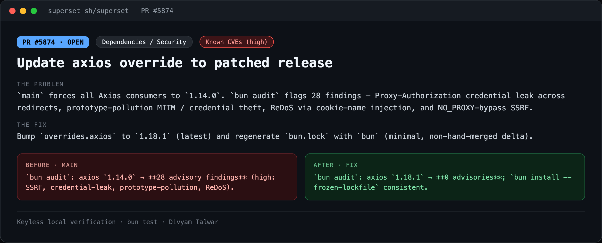
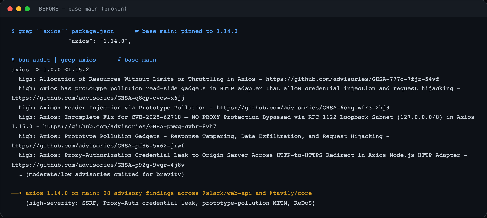
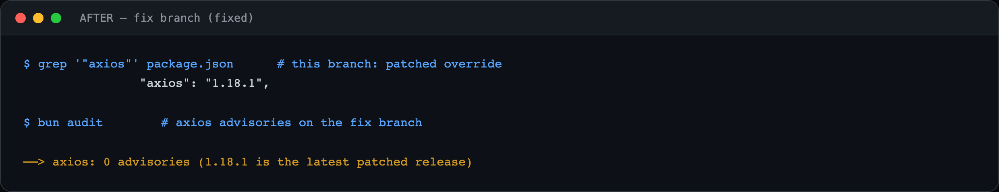

# PR12 — Update axios override to patched release

| Field | Value |
|---|---|
| PR | [#5874](https://github.com/superset-sh/superset/pull/5874) |
| Status | OPEN |
| Branch | `fix/axios-security-override` |
| Head | `9ca6b9d66` |
| Base | `superset-sh/superset:main` |
| Area | Dependencies / Security |
| Scope | root · package.json + bun.lock (12-line lock delta) |
| Risk | low |

## 1. TL;DR
The root `overrides.axios` pins every consumer to `1.14.0`. `bun audit` reports 28 advisory findings (multiple high-severity) reaching the API via `@slack/web-api` and `@tavily/core`. Bumping to `1.18.1` clears them.

## 2. The problem
`main` forces all Axios consumers to `1.14.0`. `bun audit` flags 28 findings — Proxy-Authorization credential leak across redirects, prototype-pollution MITM / credential theft, ReDoS via cookie-name injection, and NO_PROXY-bypass SSRF.

## 3. How it was identified
`bun audit` on `main` reports 28 axios findings; raising the override to the latest release clears them.

## 4. Root cause
Stale security pin — the override held axios at a version with 20+ published advisories.

## 5. The fix
Bump `overrides.axios` to `1.18.1` (latest) and regenerate `bun.lock` with `bun` (minimal, non-hand-merged delta).

## 6. Live verification (before / after) — keyless
Real output captured locally with no API key or cloud login. Raw transcripts in [`transcripts/`](./transcripts).

**Summary**

**BEFORE — base `main`**

`bun audit`: axios `1.14.0` → **28 advisory findings** (high: SSRF, credential-leak, prototype-pollution, ReDoS).

**AFTER — fix branch**

`bun audit`: axios `1.18.1` → **0 advisories**; `bun install --frozen-lockfile` consistent.

## 7. Risk, compatibility, non-goals
Risk: **low**. Supersedes #5478, which the maintainer closed while it carried a `bun.lock` conflict (now resolved, rebased clean). Opened as a follow-up because `main` is still on the vulnerable pin — deferring to the maintainer on whether/how to land it. Real-world exploitability depends on how these axios consumers are invoked; the fix removes the known-vulnerable version regardless.

## 8. CI status (honest)
New PR #5874; checks pending. `mergeable = MERGEABLE`, single clean commit, lockfile regenerated (not hand-merged).
