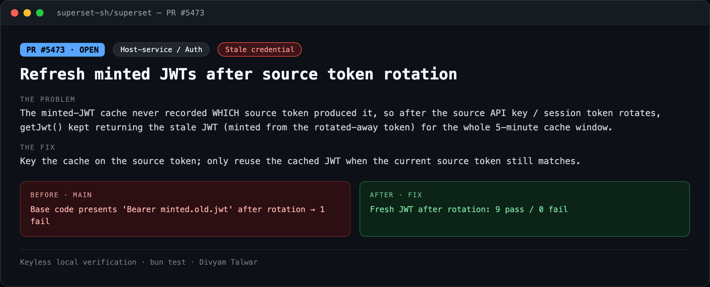
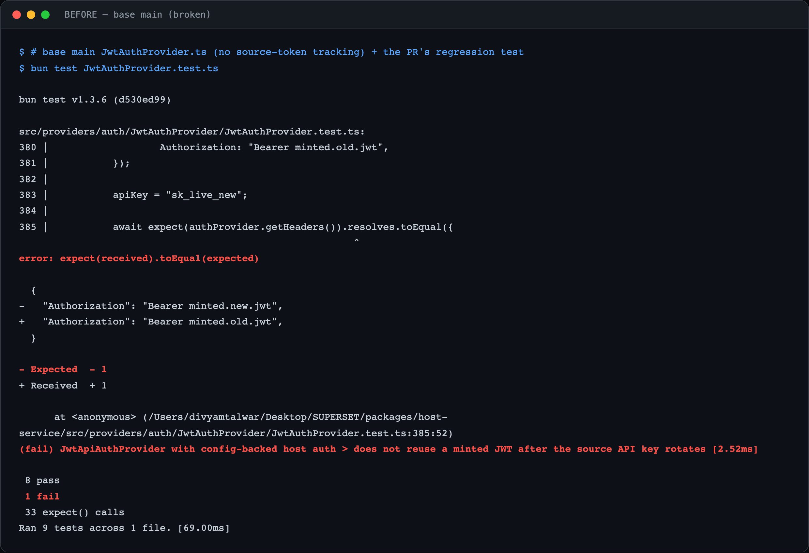
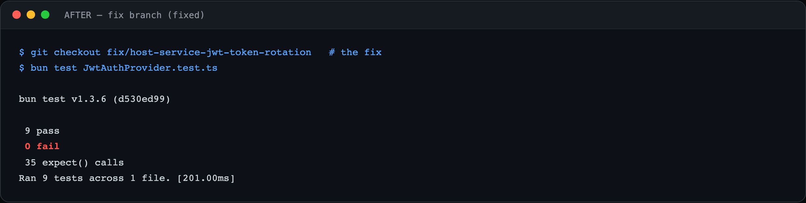

# PR2 — Refresh minted JWTs after source token rotation

| Field | Value |
|---|---|
| PR | [#5473](https://github.com/superset-sh/superset/pull/5473) |
| Status | OPEN |
| Branch | `fix/host-service-jwt-token-rotation` |
| Head | `b1c5fb539` |
| Base | `superset-sh/superset:main` |
| Area | Host-service / Auth |
| Scope | packages/host-service · 2 files, +43 −7 |
| Risk | low |

## 1. TL;DR
`JwtApiAuthProvider` cached the JWT it minted but never recorded which source token minted it. After the source API key / session token rotates, `getJwt()` kept handing back the stale JWT (bound to the rotated-away token) for the full 5-minute cache window. The fix keys the cache on the source token.

## 2. The problem
The host-service authenticates to the API by minting a short-lived JWT from a source credential and caching it for 5 minutes. If the operator rotates the source API key (or the session token refreshes), the cached JWT is now derived from a credential that no longer exists — but it is still returned until the cache TTL elapses, causing avoidable auth failures / stale-identity requests.

## 3. How it was identified
Read `JwtApiAuthProvider.getJwt()`. The cache hit-path returned `cachedJwt` purely on a TTL check, with no comparison against the *current* source token. Wrote a rotation regression test (rotate the on-disk token mid-provider) and ran it against the base code.

## 4. Root cause
The cache validity condition was `cachedJwt && now < expiresAt - buffer` — time-based only. It never asked "was this JWT minted from the token I'd use right now?", so a source-token change was invisible to the cache.

## 5. The fix
Add `cachedJwtSourceToken`; record it whenever a JWT is minted and clear it in `invalidateCache()`. Reuse the cached JWT only when `cachedJwtSourceToken === current sessionToken` *and* it is still within TTL. Move the cache check to after resolving the current session token so rotation is detected.

## 6. Live verification (before / after) — keyless
Real `bun test` output, captured locally with no API key or cloud login. Raw transcripts in [`transcripts/`](./transcripts).

**Summary**

**BEFORE — base `main` (broken)**

Base code, PR's regression test: after rotating the source key the provider still presents `Authorization: Bearer minted.old.jwt` → **1 fail** (8 pass).

**AFTER — fix branch**

Fresh JWT minted after rotation: **9 pass / 0 fail**.

## 7. Risk, compatibility, non-goals
Risk: **low**. Scope is the host-service credential cache only. Not a remote-exploitable vulnerability; the impact is stale-credential auth failures and identity staleness for up to the cache window after a rotation. No filed issue — found during code review.

## 8. CI status (honest)
CodeRabbit: pass. cubic: skipping. `BLOCKED` = awaiting required maintainer review, not failing CI.
