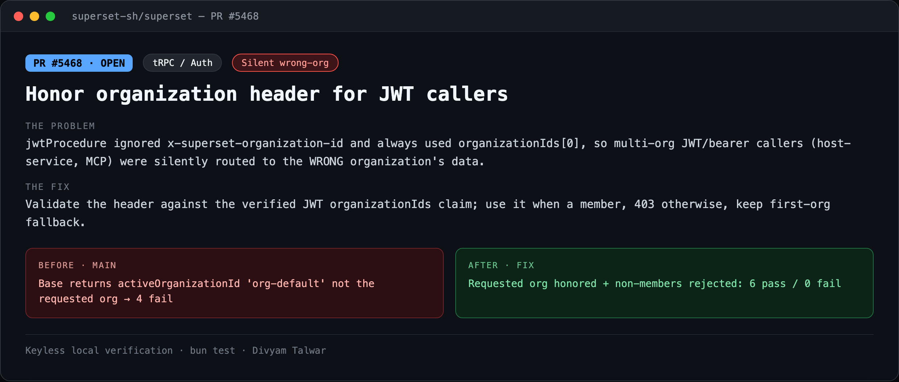
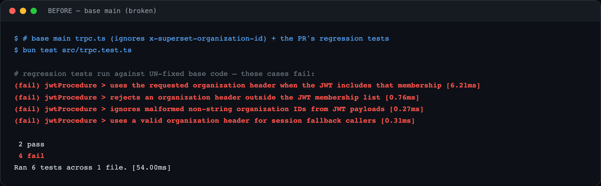
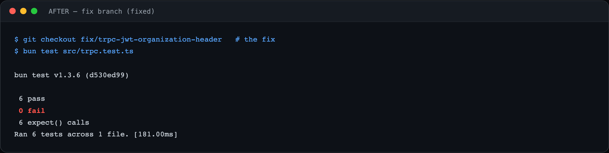

# PR3 — Honor organization header for JWT callers

| Field | Value |
|---|---|
| PR | [#5468](https://github.com/superset-sh/superset/pull/5468) |
| Status | OPEN |
| Branch | `fix/trpc-jwt-organization-header` |
| Head | `945e42888` |
| Base | `superset-sh/superset:main` |
| Area | tRPC / Auth |
| Scope | packages/trpc · 2 files, +225 −6 |
| Risk | low |

## 1. TL;DR
`jwtProcedure` ignored the `x-superset-organization-id` header and always used `organizationIds[0]`, so multi-org JWT / bearer callers (host-service, MCP) were silently routed to the wrong organization's data. The fix validates the header against the verified JWT claim and honors it, 403-ing non-members.

## 2. The problem
A JWT can carry membership in several organizations. Clients select the active org via `x-superset-organization-id`. The JWT procedure never read that header — it unconditionally picked the first org in the token. A caller acting on org B would silently read/write org A's data. Silent wrong-result on a core auth trust boundary in a shared package.

## 3. How it was identified
Read `packages/trpc/src/trpc.ts`. `jwtProcedure` set `activeOrganizationId` from `organizationIds[0]` with no reference to the request header. Wrote a table of header/membership cases and ran them against base.

## 4. Root cause
The organization-selection header was simply not consulted in the JWT path (it was only honored for session callers). Compounded by an unchecked `as string[]` cast on the JWT `organizationIds` claim.

## 5. The fix
Validate `x-superset-organization-id` against the verified `organizationIds` claim: use it when the caller is a member, `403 FORBIDDEN` when it is outside the membership set, and fall back to the first org when the header is absent. Filter non-string ids instead of casting. Two small pure helpers, 190 lines of tests.

## 6. Live verification (before / after) — keyless
Real `bun test` output, captured locally with no API key or cloud login. Raw transcripts in [`transcripts/`](./transcripts).

**Summary**

**BEFORE — base `main` (broken)**

Base `trpc.ts`, PR's tests: requested org header ignored — returns `activeOrganizationId: "org-default"` — **4 fail** (2 pass).

**AFTER — fix branch**

Header honored + non-members rejected: **6 pass / 0 fail**.

## 7. Risk, compatibility, non-goals
Risk: **low**. Not privilege escalation — callers can only reach orgs already in their own verified JWT. The defect is being routed to the *wrong* in-token org. Breadth is multi-org JWT/bearer clients; single-org and session callers are unaffected. No filed issue.

## 8. CI status (honest)
CodeRabbit: pass. cubic: skipping. `BLOCKED` = awaiting required maintainer review, not failing CI.
