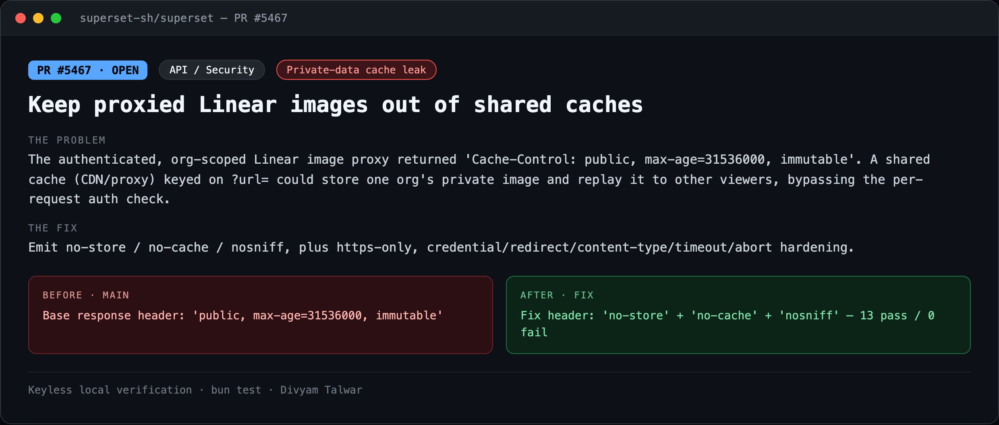
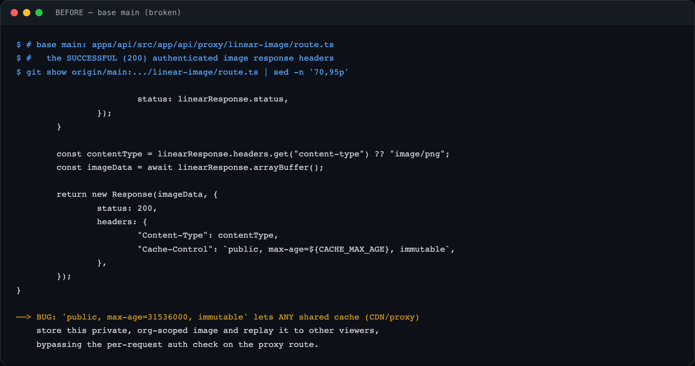
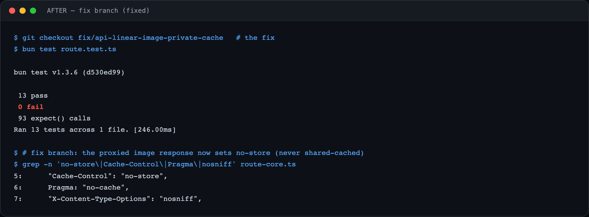

# PR4 — Keep proxied Linear images out of shared caches

| Field | Value |
|---|---|
| PR | [#5467](https://github.com/superset-sh/superset/pull/5467) |
| Status | OPEN |
| Branch | `fix/api-linear-image-private-cache` |
| Head | `7d0e04bb2` |
| Base | `superset-sh/superset:main` |
| Area | API / Security |
| Scope | apps/api · 4 files, +662 −77 |
| Risk | low |

## 1. TL;DR
The authenticated, org-scoped Linear image proxy returned `Cache-Control: public, max-age=31536000, immutable`. A shared cache (CDN / reverse proxy) keyed on `?url=` could store one org's private image and replay it to other viewers, bypassing the per-request auth check. The fix makes the response non-shareable and hardens the fetch.

## 2. The problem
`/api/proxy/linear-image` streams private, per-org Linear attachments after checking the caller's session. Marking that response `public, immutable` invites any shared HTTP cache in front of the API to retain the bytes and serve them to a *different* user whose request has the same `?url=` — a private-data exposure that side-steps the auth check the route performs.

## 3. How it was identified
Audited the proxy route. The 200 image branch set `Cache-Control: public, max-age=31536000, immutable` on an authenticated response. Extracted the handler into an injectable core and asserted the emitted headers under test.

## 4. Root cause
A private, authorization-gated response was labeled with a *shared-cacheable* directive. `public` explicitly authorizes shared caches; `immutable` + a one-year `max-age` maximizes retention/replay.

## 5. The fix
Emit `Cache-Control: no-store`, `Pragma: no-cache`, `X-Content-Type-Options: nosniff` on the image path. Additional hardening bundled: https-only upstream (reject `http://` and embedded credentials), `redirect: "error"`, a fetch timeout with client-abort (499) handling, content-type allow-listing, and upstream-body cancellation. Logic moved to `route-core.ts` with dependency injection; 430-line keyless test suite.

## 6. Live verification (before / after) — keyless
Real `bun test` output, captured locally with no API key or cloud login. Raw transcripts in [`transcripts/`](./transcripts).

**Summary**

**BEFORE — base `main` (broken)**

Base `route.ts` (200 branch): `Cache-Control: public, max-age=31536000, immutable`.

**AFTER — fix branch**

Fix: `no-store` + `no-cache` + `nosniff`, proven by **13 pass / 0 fail** asserting the headers and the 400/401/415/499/502 paths.

## 7. Risk, compatibility, non-goals
Risk: **low**. Defense-in-depth: a real leak requires a shared cache actually fronting the authenticated API and keying on the proxy URL. No confirmed production exposure, and no filed issue (self-found). The diff is larger than the one-line header change because it also lands the SSRF/timeout/abort hardening and the CI test wiring under one review.

## 8. CI status (honest)
CodeRabbit: pass. cubic: skipping. `BLOCKED` = awaiting required maintainer review, not failing CI.
