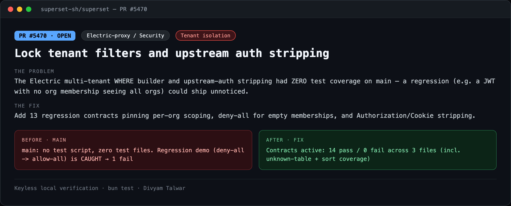
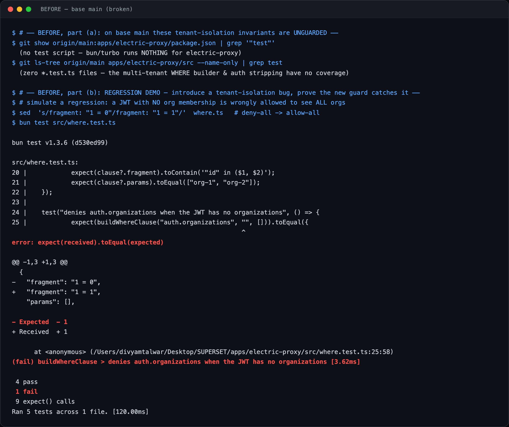
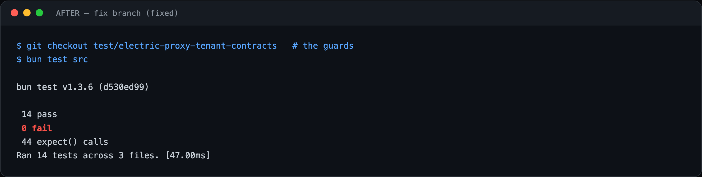

# PR5 — Lock tenant filters and upstream auth stripping

| Field | Value |
|---|---|
| PR | [#5470](https://github.com/superset-sh/superset/pull/5470) |
| Status | OPEN |
| Branch | `test/electric-proxy-tenant-contracts` |
| Head | `b34896e8c` |
| Base | `superset-sh/superset:main` |
| Area | Electric-proxy / Security |
| Scope | apps/electric-proxy · 6 files, +249 |
| Risk | low |

## 1. TL;DR
The Electric multi-tenant WHERE builder and upstream-auth stripping had zero test coverage on `main`. This PR adds 13 regression contracts pinning per-org scoping, deny-all for empty memberships, and `Authorization`/`Cookie` stripping — so a tenant-isolation regression fails CI instead of shipping.

## 2. The problem
`apps/electric-proxy` rewrites client shape requests into tenant-scoped SQL WHERE clauses and strips caller credentials before proxying upstream to Electric. These are the proxy's core tenant-isolation controls, and on `main` they had no `test` script and no test files — a regression (e.g. dropping the org filter, or forwarding the caller's `Authorization`) could merge unnoticed and expose cross-tenant data.

## 3. How it was identified
Reviewed `where.ts` / `index.ts`. The per-table org scoping and the `auth.organizations` deny-all (`1 = 0` when the JWT has no memberships) were correct but untested. Confirmed `main` has neither a `test` script nor `*.test.ts` for this app.

## 4. Root cause
No behavioral defect in current `main` — the gap is *unguarded* security-critical logic. The risk is a future regression to tenant scoping or credential stripping with nothing to catch it.

## 5. The fix
Add `where.test.ts` (per-table scoping, `auth.organizations` membership limiting, empty-membership deny-all, unknown-table rejection), `index.test.ts` (upstream `Authorization`/`Cookie` stripping, 401 on missing auth), and `electric.test.ts` (upstream URL building). Wire a `test` script + `bun-types` so `turbo test` runs them.

## 6. Live verification (before / after) — keyless
Real `bun test` output, captured locally with no API key or cloud login. Raw transcripts in [`transcripts/`](./transcripts).

**Summary**

**BEFORE — base `main` (broken)**

`main`: no `test` script, zero `*.test.ts`. **Regression demo** — flip the deny-all guard `1 = 0` → `1 = 1` (a no-membership JWT would see *all* orgs); the new contract catches it → **1 fail**.

**AFTER — fix branch**

Contracts active and green: **14 pass / 0 fail** across 3 files (incl. unknown-table + sort coverage added in review).

## 7. Risk, compatibility, non-goals
Risk: **low**. This is a hardening / regression-contract PR, not a runtime bugfix — `main`'s behavior is already correct, so there is no red-on-base for the production code. The 'before' therefore has two honest parts: (a) `main` guards nothing, and (b) a deliberately-introduced regression is demonstrably caught by the new tests. No filed issue.

## 8. CI status (honest)
CodeRabbit: pass. cubic: skipping. `BLOCKED` = awaiting required maintainer review, not failing CI.
