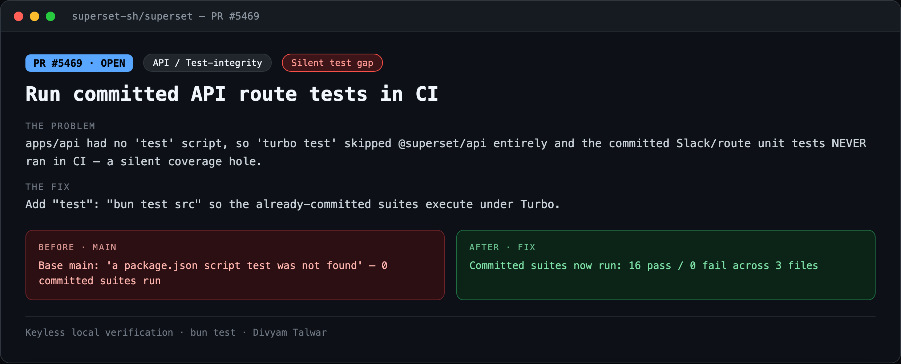
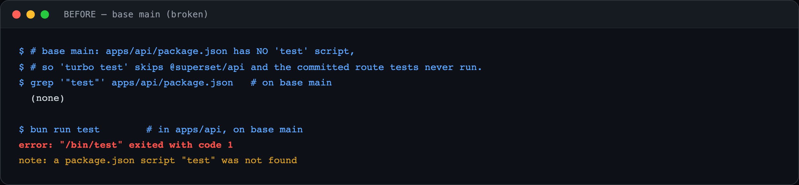
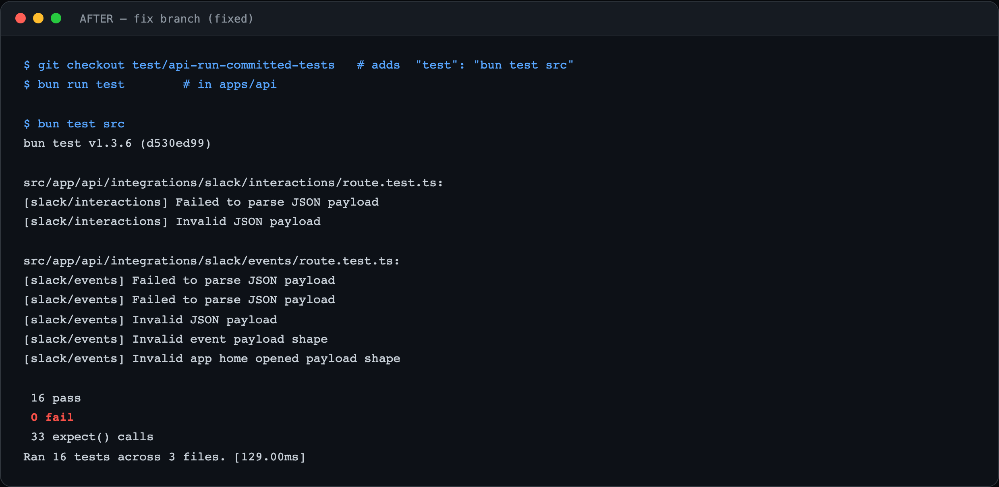

# PR6 — Run committed API route tests in CI

| Field | Value |
|---|---|
| PR | [#5469](https://github.com/superset-sh/superset/pull/5469) |
| Status | OPEN |
| Branch | `test/api-run-committed-tests` |
| Head | `698e58ae3` |
| Base | `superset-sh/superset:main` |
| Area | API / Test-integrity |
| Scope | apps/api · 1 file, +1 |
| Risk | low |

## 1. TL;DR
`apps/api` had no `test` script, so `turbo test` skipped `@superset/api` entirely and the already-committed Slack/route unit tests never ran in CI — a silent coverage hole. One line wires them in.

## 2. The problem
Several unit suites are committed under `apps/api/src` (Slack events, Slack interactions, Stripe notify-slack blocks). With no `test` script in `apps/api/package.json`, Turbo has nothing to invoke, so those tests execute on no one's machine but a developer who runs them by hand. Regressions in that code ship untested.

## 3. How it was identified
Ran `turbo test` and noticed `@superset/api` was skipped. `apps/api/package.json` had no `test` script even though `*.test.ts` files exist in its tree.

## 4. Root cause
Missing `"test"` script in the workspace's `package.json`. Turbo keys off the script; absent it, the package is silently excluded from the test graph.

## 5. The fix
Add `"test": "bun test src"` to `apps/api/package.json` so Turbo discovers and runs the committed suites.

## 6. Live verification (before / after) — keyless
Real `bun test` output, captured locally with no API key or cloud login. Raw transcripts in [`transcripts/`](./transcripts).

**Summary**

**BEFORE — base `main` (broken)**

Base `main`: `bun run test` in `apps/api` → `a package.json script "test" was not found` — **0 committed suites run**.

**AFTER — fix branch**

Committed suites now run: **16 pass / 0 fail** across 3 files.

## 7. Risk, compatibility, non-goals
Risk: **low**. Pure test-infra change; zero runtime code. Note: PR #5467 also adds this wiring as part of its CI hardening — this is the minimal standalone version and the two overlap on that one line.

## 8. CI status (honest)
CodeRabbit: pass. cubic: skipping. `BLOCKED` = awaiting required maintainer review, not failing CI.
