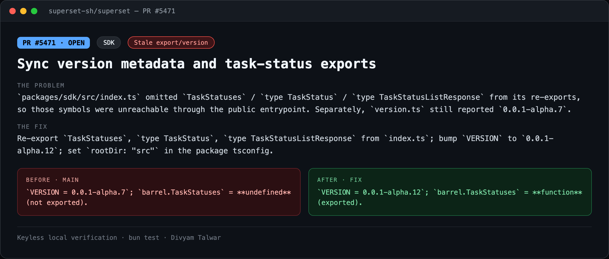
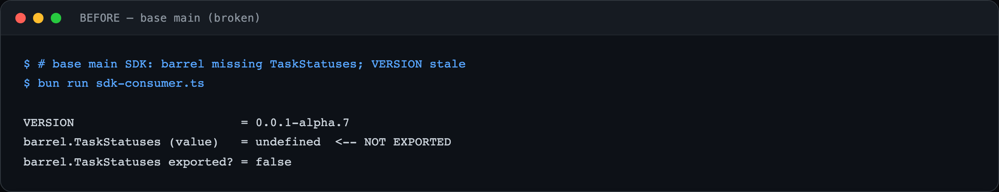
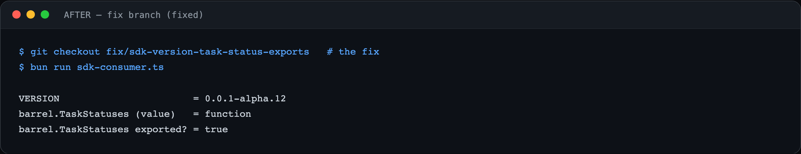

# PR7 — Sync version metadata and task-status exports

| Field | Value |
|---|---|
| PR | [#5471](https://github.com/superset-sh/superset/pull/5471) |
| Status | OPEN |
| Branch | `fix/sdk-version-task-status-exports` |
| Head | `b12829af4` |
| Base | `superset-sh/superset:main` |
| Area | SDK |
| Scope | packages/sdk · 3 files, +6 −2 |
| Risk | low |

## 1. TL;DR
The SDK barrel never re-exported the `TaskStatuses` client or its `TaskStatus` types, so consumers of `@superset/sdk` couldn't reach the task-status resource that was already implemented. `VERSION` was also stale at `0.0.1-alpha.7`.

## 2. The problem
`packages/sdk/src/index.ts` omitted `TaskStatuses` / `type TaskStatus` / `type TaskStatusListResponse` from its re-exports, so those symbols were unreachable through the public entrypoint. Separately, `version.ts` still reported `0.0.1-alpha.7`.

## 3. How it was identified
Imported the SDK barrel in a tiny keyless consumer and destructured `TaskStatuses` and `VERSION`: the runtime value was `undefined` (not exported) and the version lagged the package.

## 4. Root cause
Missing re-export lines in the barrel plus an un-bumped `VERSION` constant.

## 5. The fix
Re-export `TaskStatuses`, `type TaskStatus`, `type TaskStatusListResponse` from `index.ts`; bump `VERSION` to `0.0.1-alpha.12`; set `rootDir: "src"` in the package tsconfig.

## 6. Live verification (before / after) — keyless
Real output captured locally with no API key or cloud login. Raw transcripts in [`transcripts/`](./transcripts).

**Summary**

**BEFORE — base `main`**

`VERSION = 0.0.1-alpha.7`; `barrel.TaskStatuses` = **undefined** (not exported).

**AFTER — fix branch**

`VERSION = 0.0.1-alpha.12`; `barrel.TaskStatuses` = **function** (exported).

## 7. Risk, compatibility, non-goals
Risk: **low**. Low severity — public API-surface completeness + metadata sync, no runtime/security impact. No filed issue.

## 8. CI status (honest)
CodeRabbit: pass. cubic: skipping. `BLOCKED` = awaiting required maintainer review, not failing CI.
