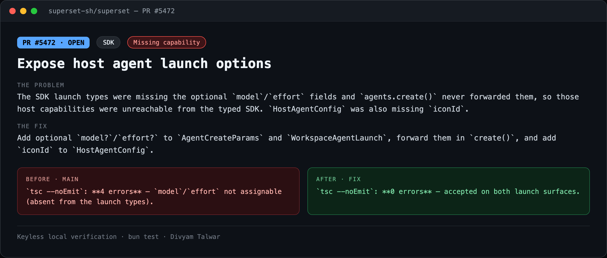
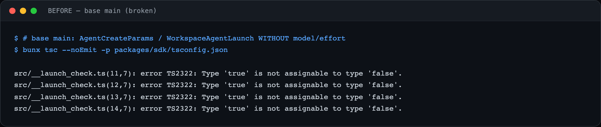
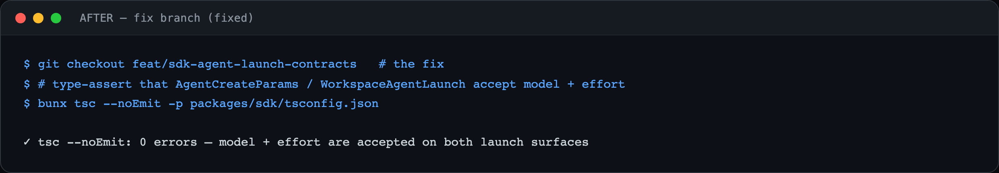

# PR8 — Expose host agent launch options

| Field | Value |
|---|---|
| PR | [#5472](https://github.com/superset-sh/superset/pull/5472) |
| Status | OPEN |
| Branch | `feat/sdk-agent-launch-contracts` |
| Head | `e33de5c39` |
| Base | `superset-sh/superset:main` |
| Area | SDK |
| Scope | packages/sdk · 2 files, +12 |
| Risk | low |

## 1. TL;DR
`AgentCreateParams` and `WorkspaceAgentLaunch` didn't accept `model` or `effort`, so SDK callers couldn't pick an agent model or reasoning effort at launch even though the host supports it. `HostAgentConfig` also lacked the `iconId` the host returns.

## 2. The problem
The SDK launch types were missing the optional `model`/`effort` fields and `agents.create()` never forwarded them, so those host capabilities were unreachable from the typed SDK. `HostAgentConfig` was also missing `iconId`.

## 3. How it was identified
Added a type-level assertion that `model`/`effort` are keys of the launch params and ran `tsc`; it rejected them on base.

## 4. Root cause
The optional launch fields were simply absent from the interfaces and not forwarded in `create()`.

## 5. The fix
Add optional `model?`/`effort?` to `AgentCreateParams` and `WorkspaceAgentLaunch`, forward them in `create()`, and add `iconId` to `HostAgentConfig`.

## 6. Live verification (before / after) — keyless
Real output captured locally with no API key or cloud login. Raw transcripts in [`transcripts/`](./transcripts).

**Summary**

**BEFORE — base `main`**

`tsc --noEmit`: **4 errors** — `model`/`effort` not assignable (absent from the launch types).

**AFTER — fix branch**

`tsc --noEmit`: **0 errors** — accepted on both launch surfaces.

## 7. Risk, compatibility, non-goals
Risk: **low**. Additive, fully backward-compatible (all new fields optional). No filed issue.

## 8. CI status (honest)
CodeRabbit: pass. cubic: skipping. `BLOCKED` = awaiting required maintainer review, not failing CI.
