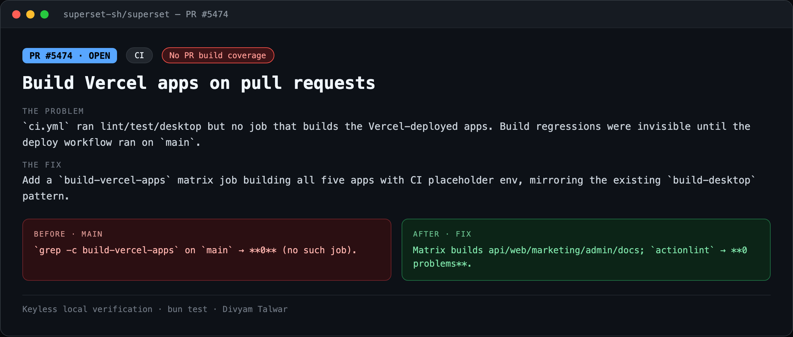
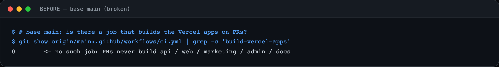
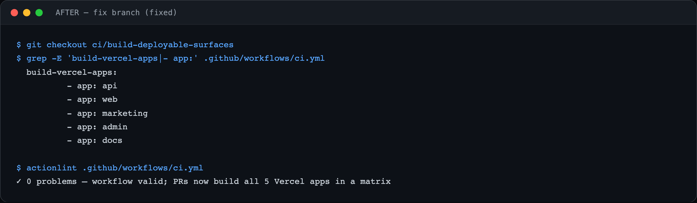

# PR9 — Build Vercel apps on pull requests

| Field | Value |
|---|---|
| PR | [#5474](https://github.com/superset-sh/superset/pull/5474) |
| Status | OPEN |
| Branch | `ci/build-deployable-surfaces` |
| Head | `3366c0925` |
| Base | `superset-sh/superset:main` |
| Area | CI |
| Scope | .github/workflows/ci.yml · +71 |
| Risk | low |

## 1. TL;DR
PRs never built the deployable Next.js apps (api/web/marketing/admin/docs), so a change that breaks a production build could merge and only fail later at deploy time.

## 2. The problem
`ci.yml` ran lint/test/desktop but no job that builds the Vercel-deployed apps. Build regressions were invisible until the deploy workflow ran on `main`.

## 3. How it was identified
Reviewed `ci.yml` — there was no `build-vercel-apps`-style job.

## 4. Root cause
Missing CI job.

## 5. The fix
Add a `build-vercel-apps` matrix job building all five apps with CI placeholder env, mirroring the existing `build-desktop` pattern.

## 6. Live verification (before / after) — keyless
Real output captured locally with no API key or cloud login. Raw transcripts in [`transcripts/`](./transcripts).

**Summary**

**BEFORE — base `main`**

`grep -c build-vercel-apps` on `main` → **0** (no such job).

**AFTER — fix branch**

Matrix builds api/web/marketing/admin/docs; `actionlint` → **0 problems**.

## 7. Risk, compatibility, non-goals
Risk: **low**. CI-only, no runtime code. Evidence is config-level: the workflow diff + `actionlint` validation. I did not execute the full 5-app build here (it needs the CI runner env / services).

## 8. CI status (honest)
New/updated job; `actionlint` clean. `BLOCKED` = awaiting required maintainer review.
